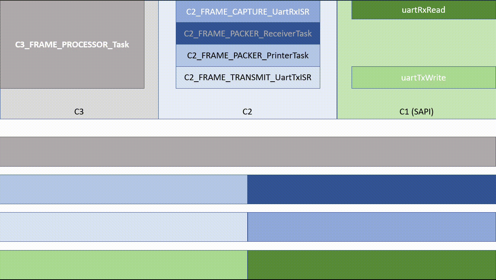

# TP RTOSII - CESE15Co 2021

#### Fecha: 05/11/2021

#### Versión: 1.1

#### Integrantes:
- DOMINGUEZ SHOCRÓN, Marcos Raúl - <mrds0690@gmail.com>
- MORZÁN, Pablo Javier - <pablomorzan@gmail.com>
- RÍOS, Martín Julián - <jrios@fi.uba.ar>

#### Tabla de versiones
| Versión | Fecha | Modificaciones |
|:--- |:---|:---|
| v 1.0 |  5/11/2021  | **Versión inicial: se entregan requisitos R_C2_1 a R_C2_9**  |
|  |  | - Se elige estructura de memoria dinámica | 
|  |  | - Se define estructura de capas y contexto de cada función según requisitos |
|  |  | - Se establece comunicación entre capas y funciones buscando mantener modularidad |
|  |  | - Se implementa recepción de datos en contexto de interrupción |
| v 1.1 |  8/11/2021  | **Se entregan requisitos R_C2_10 a R_C2_16**  |
|  |  | - Chequeo de validez de ID | 
|  |  | - Se prueba con 2 instancias a máxima velocidad (Se pierden 10% de datos |
|  |  | - Se modifica procesamiento de datos de entrada de tipo "if-else" por máquina de estados switch-case anidado con chequeo de SOM-EOM en C2_FRAME_CAPTURE_UartRxInit |
|  |  | - Se agregan secciones críticas al gestionar el pool en contexto de interrupción taskENTER_CRITICAL_FROM_ISR/taskEXIT_CRITICAL_FROM_ISR |
|  |  | - Se agrega lectura de UART en caso de acumulación en buffer |
|  |  | - Se valida CRC en recepción |
|  |  | - Se calcula y agrega CRC a dato de salida |
|  |  | - Se prueba con 4000 mensajes en una instancia a máxima velocidad y no se pierden datos |
|  |  | - Se implementa rutina de envío de datos por Tx a través de ISR. |
|  |  | - Se elimina Tabla 1 y se pasan detalles al código |
| v 1.2 |  19/11/2021  | **Se entregan requisitos R_C2_17 a R_C22_**  |
|  |  | - Se realizan modificaciones de estructura para cumplir con sugerencias en corrección semanal |
|  |  | - Se implementa timer con overflow de 4ms - con función de callback para descarte de tramas que demoren mas de 4ms entre datos antes de EOM |
|  |  | - Se chequea cumplimiento de incisos 20 a 22 implementado en anterior entrega. |

#### Justificación de arquitectura del TP
- ***Gestión de datos:*** aplicamos un patrón de asignación de objetos desde un pool de memoria _(Quantum Leaps - QMPool v6.2.0)_, el cual crea diferentes colecciones estáticas de objetos del mismo tipo. Si se requiere un objeto o bloque de objetos se lo puede solicitar de la colección disponible, y cuando ya no se lo precisa se puede liberar, quedando nuevamente disponible. En nuestro caso utilizamos una estructura pero lo inicializamos a través de un puntero pedido por pvPortMalloc, por lo que queda establecido en zona de memoria dinámica; en esta versión se crean 7 bloques de 200 unidades de datos de tipo _uint_8t_, estos bloques funcionan como buffer de recepción de datos. Con esto buscamos que al crear una nueva instancia se pueda reservar un nuevo pool en tiempo de ejecución.
Esto se podría haber resuelto con asignación dinámica de cada dato (malloc/free), pero sería propenso a la fragmentación del espacio de memoria por la frecuencia de pedido/liberación que se espera. Otra alternativa que no es aceptable es la asignación de memoria estática en momento de compilación para el almacenamiento de cada dato, pero nos quedaríamos sin espacio de almacenamiento rápidamente.

- ***Taréas:*** se crean tareas como métodos de los objetos modularizados en cada archivo. A su vez estos pertenecen a una capa y no conocen los atributos ni métodos privados de los objetos de otras capas, la estructura de las mismas se resume en animación al final de Readme.md. Por el momento no se eliminan y sólo será necesario en caso de terminar una instancia de comunicación. Así mismo, si se crea una nueva instancia  de una clase se crearán nuevas tareas.

- ***Técnicas:***

#### Justificación del esquema de memoria dinámica utilizado
En la primera etapa de este trabajo práctico se decide utilizar un esquema de tipo **Heap4**. Las caracteristicas particulares que buscamos en este esquema son los siguientes:
- Fusión de espacios de memoria adyacentes liberados. Esto previene en gran medida la fragmentación del espacio de memoria.
- La capacidad de configurar el espacio de memoria necesario con **configTOTAL_HEAP_SIZE**. Al crear instancias nuevas con el pool en memoria dinámica podría ser necesario modificar este parámetro.
- Tener la capacidad de eliminar tareas, semaforos, colas, etc..

Si en un futuro se observa que el sistema puede resolverse sin eliminaciones se optaría por un esquema de tipo **Heap1** para poder tener un sistema determinista; en caso de no tener suficiente memoria para resolver el TP se elijiría **Heap5**.

| Código de requerimiento | Referencia al tratamiento |
|:---: |:---|
| R_C2_1 | Se justifica en README.md |
| R_C2_2 | C2_FRAME_CAPTURE_UartRxISR - En condición **if (frame_capture->buff_ind >= MAX_BUFFER_SIZE)** |
| R_C2_3 | C2_FRAME_CAPTURE_UartRxISR - Se utiliza switch-case para decidir sobre los caracteres recibidos |
| R_C2_4 | C2_FRAME_CAPTURE_UartRxISR - **switch (character) {case START_OF_MESSAGE:** //rutina de iniciación de paquete... |
| R_C2_5 | C2_FRAME_CAPTURE_UartRxISR - **char character = uartRxRead(frame_capture->uart)** - //luego se procesa | 
| R_C2_6 | C2_FRAME_CAPTURE_UartRxISR - En Start Of Message se usa - **frame_capture->raw_frame.data = (char \*) QMPool_get(frame_capture->buffer_handler.pool, 0)**; para dirigir datos a raw_frame.data que apunta al pool |
| R_C2_7 | C2_FRAME_CAPTURE_UartRxISR - En condición - **if (frame_capture->buff_ind >= MAX_BUFFER_SIZE)** se usa la etiqueta para establecer la máxima cantidad de caracteres |
| R_C2_8 | Se utiliza algoritmo (Quantum Leaps - QMPool v6.2.0), asignando un tamaño de n bloques de **MAX_BUFFER_SIZE** elementos **uint8_t**. Cada vez que se inicia una trama se realiza un QMPool_get que pide un nuevo bloque en caso de tenerlo disponible. Esto posibilita seguir adquiriendo mientras se procesa tramas previas  |
| R_C2_9 | C2_FRAME_CAPTURE_UartRxISR - Si la asignación de un bloque de pool devuelve un NULL no se cumple la función para comenzar la adquisición. Queda en estado IDLE, ignorando datos. ¿Debería desactivarse interrupción hasta que se libere memoria? |
| R_C2_10 | C2_FRAME_CAPTURE_UartRxISR en el estado **FRAME_CAPTURE_STATE_ID_CHECK** valida el ID del inicio de la trama. En la misma función se chequea y valida el CRC recibido cuando se recibe EOM, con la función **C2_FRAME_CAPTURE_CheckCRC(frame_capture->raw_frame, frame_capture->crc)** |
| R_C2_11 | Se utiliza función **C2_FRAME_CAPTURE_AsciiHexaToInt(char \*ascii, uint8_t n)** para transformar CRC en Hexa y poder validarlo |
| R_C2_12 | C2_FRAME_CAPTURE_UartRxISR - Para chequear ID se utiliza un macro con un operador condicional ternario **CHECK_HEXA(character)**, para CRC se implementa una función **C2_FRAME_CAPTURE_CheckCRC**. Si no se cumplen estas condiciones se vuelve al estado IDLE hasta el comienzo de otra |
| R_C2_13 | C2_FRAME_TRANSMIT_UartTxISR - utiliza una MEF para agregar el código de comprobación, la identificación y los delimitadores |
| R_C2_14 | C2_FRAME_TRANSMIT_UartTxISR - es una función de callback que se llama en la interrupción de los datos por UART Tx y es en donde se procesan los bytes salientes |
| R_C2_15 | C2_FRAME_TRANSMIT_UartTxISR - Luego de enviar el EOM se libera la memoria dinámica utilizada para la transacción **QMPool_put(printer_resources->pool...** |
| R_C2_16 | C2_FRAME_PACKER_Print - Se arma el paquete con los datos procesados, agregando los delimitadores, el ID y el nuevo CRC |
| R_C2_17 | C2_FRAME_CAPTURE_vTimerCallback - Se crea la función de callback para descartar la trama en la que un dato demore mas de 4 ms en  |
| R_C2_18 | C2_FRAME_CAPTURE_ObjInit - Se crea un timer y se lo incluye como atributo en la estructura frame_capture_t para que cada instancia tenga su timer  |
| R_C2_19 | C2_FRAME_CAPTURE_ObjInit - Se programa el timer con 4 Ticks de 1 ms para el overflow |
| R_C2_20 | crc8_calc - Se utiliza función para calcular crc a medida que van llegando los datos  |
| R_C2_21 | C2_FRAME_CAPTURE_UartRxISR --> C2_FRAME_CAPTURE_CheckCRC - el paquete no se envía a menos que el crc calculado sea igual al recibido |
| R_C2_22 | C2_FRAME_PACKER_Receive - Recibe a través de una cola un puntero a una estructura frame_t que contiene un puntero a los datos y el tamaño de los mismos. Esta función es llamada dentro de la aplicación |

